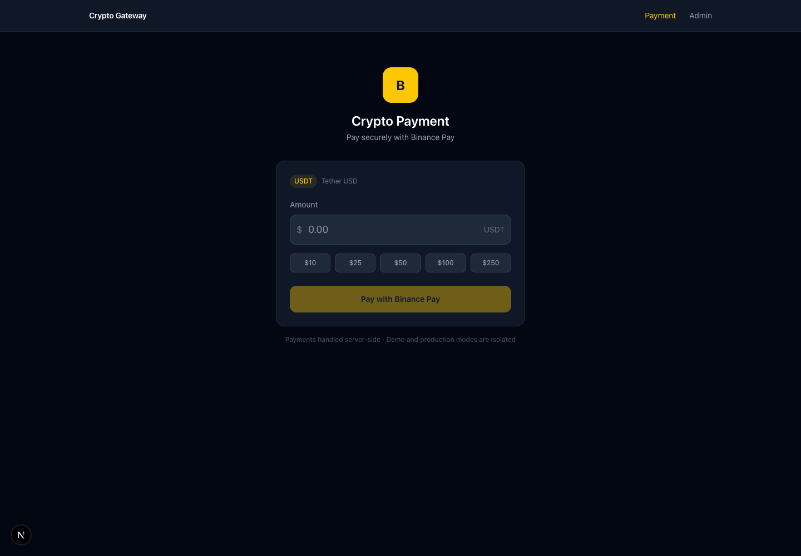
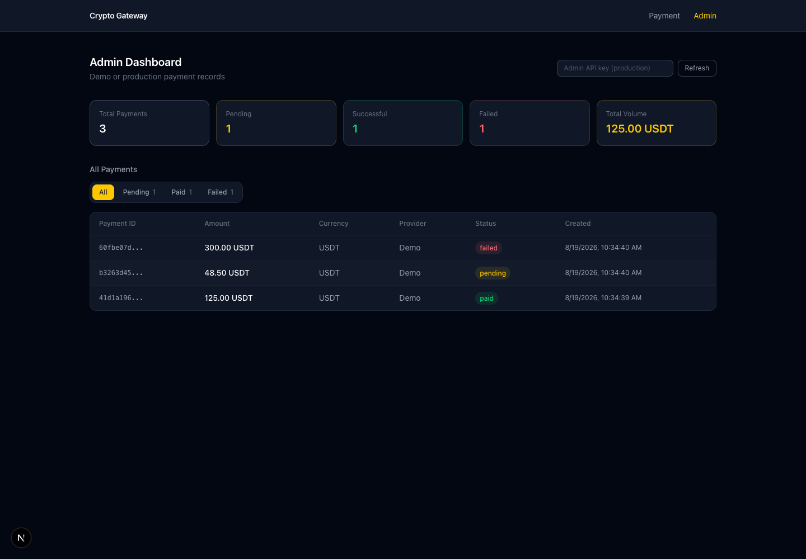

# Crypto Payment Gateway — Portfolio Demo

A Next.js payment-flow demo with a preserved customer checkout UI, payment status page, and admin dashboard. It is designed to run locally and in CI without Supabase or Binance credentials.

> **Portfolio software, not a production payment system.** `DEMO_MODE` stores records only in the current Node.js process and creates simulated checkout URLs. No cryptocurrency is transferred. The production integration creates Binance Pay orders, but this repository does not implement the signed webhook verification, reconciliation, durable rate-limit storage, monitoring, or operational controls required for real payments.

## Product tour

| Customer payment form | Demo administration dashboard |
| --- | --- |
|  |  |

The dashboard screenshot contains only generated demo identifiers and simulated payment records.

## Modes

### Demo mode (recommended)

Set `DEMO_MODE=true`. The server uses an isolated in-memory payment repository and the local mock checkout. It never initializes Supabase and never calls Binance. Data is ephemeral and may disappear on restart, rebuild, or serverless instance changes.

### Production integration mode (advanced, incomplete)

Set `DEMO_MODE=false` explicitly. The server then requires all of:

- `NEXT_PUBLIC_SUPABASE_URL`
- `SUPABASE_SERVICE_ROLE_KEY`
- `ADMIN_API_KEY`
- `BINANCE_PAY_API_KEY`
- `BINANCE_PAY_API_SECRET`

There is no credential-based fallback to demo behavior. `DEMO_MODE` must be exactly `true` or `false`; unset or malformed values fail closed when an API request reaches the runtime. This keeps credential-free builds possible without silently choosing a payment mode. Missing production values also fail closed. The service-role key must remain server-side and must never be exposed through a `NEXT_PUBLIC_` variable.

The mock status mutation endpoint returns `403` outside demo mode. A real deployment must implement and verify Binance Pay webhook signatures before changing payment state.

## Quick start

Requirements: Node.js 22+ and npm.

```bash
cp .env.local.example .env.local
npm ci
npm run dev
```

The example environment enables safe demo mode. Open:

- Checkout: <http://localhost:3000>
- Admin dashboard: <http://localhost:3000/admin>

Create a payment, choose confirm or decline on the clearly marked simulated checkout, then view its status. Demo records are process-local and intentionally non-durable.

## Verification

```bash
npm ci
npm run lint
npm test
npm run build
npm audit
```

Vitest covers the demo/production boundary, credential fail-closed behavior, production admin authorization, mock-mutation protection, validation, and request throttling. GitHub Actions runs install, lint, tests, build, and a high-severity audit gate with `DEMO_MODE=true`.

## Production security setup

1. Create a dedicated Supabase project and run `supabase/schema.sql` in its SQL editor.
2. Confirm that Row Level Security is enabled and forced on `public.payments`.
3. Confirm there are **no** policies or table grants for `anon` or `authenticated`. The schema removes the original public allow-all policy.
4. Store the Supabase service-role key, Binance secrets, and a long random `ADMIN_API_KEY` only in server-side secret storage.
5. Set `DEMO_MODE=false`; never expose the mock checkout route as a real payment method.
6. Terminate TLS at a trusted HTTPS reverse proxy. Leave `TRUST_PROXY=false` unless that proxy strips client-supplied forwarding headers and writes authoritative `x-forwarded-for`/`x-real-ip` values; only then set `TRUST_PROXY=true`. Without trusted proxy identity, the safe per-process limiter intentionally groups requests into one conservative bucket.
7. Replace the included bounded per-process limiter with a shared Redis/edge/WAF limiter before a multi-instance deployment, and retain upstream abuse controls.
8. Add authenticated admin sessions or a secret-management front end. The list API itself requires a production bearer token, throttles verification attempts, and returns `Cache-Control: no-store`. The dashboard keeps the entered key only in current page memory.
9. Before handling money, add verified Binance webhooks, idempotency keys, durable reconciliation, structured audit logs, alerting, key rotation, abuse controls, and an independent security review. The current best-effort failure update can still leave a pending record if both provider/reference creation and the compensating database update fail; operators need a reconciliation job for that case.

Example production admin API request:

```bash
curl -H "Authorization: Bearer $ADMIN_API_KEY" \
  http://localhost:3000/api/payments/list
```

## API safeguards

- `POST /api/payments/create`: accepts only finite JSON numbers from 0.01 through 100,000 with at most two decimal places; allows 20 requests/minute/client.
- `GET /api/payments/status`: returns only the customer-facing amount, currency, status, provider label, creation time, and payment ID; provider references are not exposed. Allows 60 requests/minute/client.
- `PATCH /api/payments/status`: allows 20 requests/minute/client and is available only in explicit demo mode.
- `GET /api/payments/list`: public only in demo mode; production requires the server-checked admin bearer token and allows 10 verification/list attempts per minute/client.
- Payment, status, and administration API responses use `Cache-Control: no-store`. Binance responses must contain non-empty identifiers and checkout URLs on the exact expected HTTPS Binance origins; demo checkout URLs must remain local and relative.

Rate limits are intentionally dependency-free for this demo and apply per application process. Multi-instance production deployments need a shared limiter.

## Technology

- Next.js App Router, React, and TypeScript
- Tailwind CSS
- Supabase/PostgreSQL in explicitly selected production mode
- Binance Pay order API in explicitly selected production mode
- Vitest and ESLint

## License

[MIT](LICENSE)
